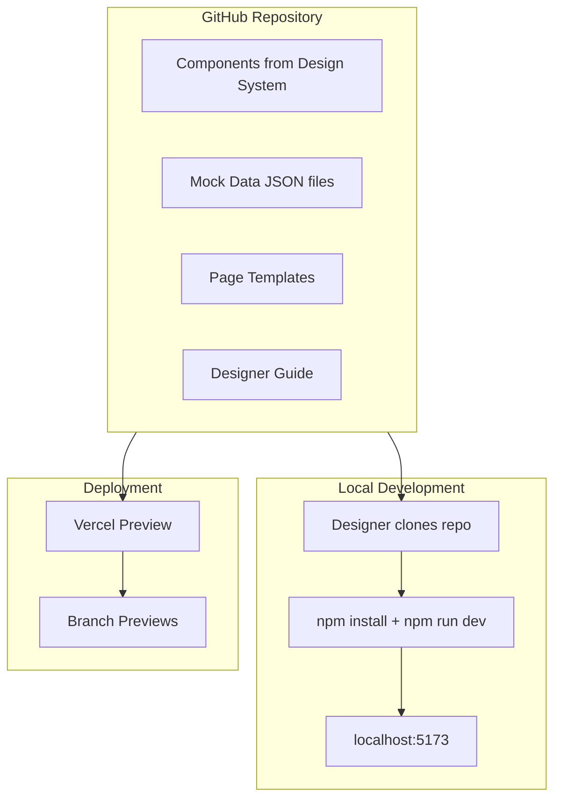
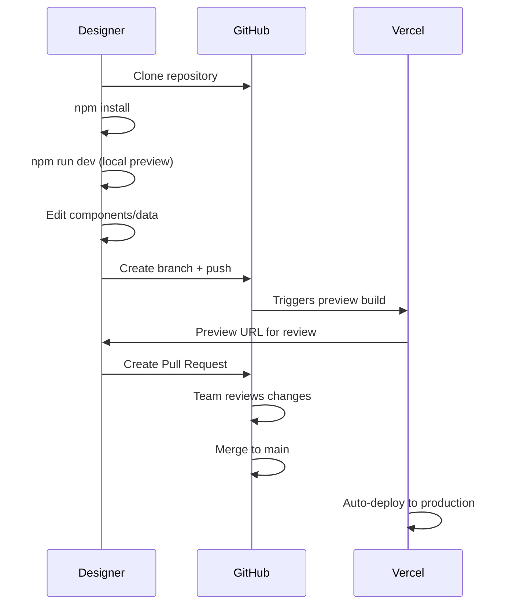

# Design System Prototype Repository

## Recommended Tech Stack

**Vite + React + TypeScript** is my top recommendation because:

- Fastest dev server startup (sub-second)
- Minimal configuration
- Easy for designers with basic dev experience
- Excellent hot module replacement (changes appear instantly)

---

## Architecture Overview



---

## Component Strategy

Since you have **both Storybook and Figma**, you have two options:

### Option A: Import from npm package (Recommended if available)

If your components are published as an npm package, install them directly:

```bash
npm install @your-org/design-system
```

This keeps you in sync with the latest design system changes automatically.

### Option B: Recreate components locally

If components aren't packaged, create a `/components` folder mirroring your Storybook structure. Use Figma's Dev Mode to extract exact styles, tokens, and spacing.---

## Mock Data Structure

Create a `/data` folder with JSON files that are easy for designers to edit:

```javascript
/data
  accounts.json      # Account balances, types
  transactions.json  # Transaction history
  users.json         # User profiles
  settings.json      # App configuration
```

Example `transactions.json`:

```json
{
  "transactions": [
    {
      "id": "txn_001",
      "description": "Stripe",
      "amount": -1250.00,
      "date": "2024-12-18",
      "category": "Software"
    }
  ]
}
```

Designers can modify these files without touching code.---

## Project Structure

```javascript
mercury-prototype/
├── public/
├── src/
│   ├── components/       # Design system components
│   ├── pages/            # Full page layouts
│   ├── data/             # Mock JSON data
│   ├── styles/           # Global styles, fonts, tokens
│   ├── hooks/            # Data loading hooks
│   └── App.tsx
├── docs/
│   └── DESIGNER_GUIDE.md # How to use this repo
├── package.json
└── README.md
```

---

## Deployment Options Comparison

| Platform | Pros | Cons | Best For ||----------|------|------|----------|| **Vercel** | Free tier, automatic branch previews, zero config | Team features cost money | Your use case - familiar, reliable || **Netlify** | Similar to Vercel, good free tier | Slightly slower builds | Alternative if you want to try something new || **GitHub Pages** | Free, integrated with repo | No branch previews, manual setup | Static-only, budget option || **Cloudflare Pages** | Generous free tier, fast CDN | Less polished UI | Cost-conscious teams |**My recommendation: Stick with Vercel** since you're familiar with it. Key features for your use case:

- **Branch previews**: Every PR gets a unique URL for review
- **Instant rollbacks**: Easy to revert if something breaks
- **Zero config**: Just connect your GitHub repo

---

## Designer Workflow



---

## Designer Guide Contents

The `DESIGNER_GUIDE.md` will include:

1. One-time setup instructions (install Node.js, clone repo)
2. Daily workflow (pull latest, create branch, make changes)
3. How to modify mock data
4. How to preview changes locally
5. How to submit changes (PR process)
6. Troubleshooting common issues

---

## Implementation Steps

1. **Initialize Vite + React project** with TypeScript
2. **Set up design tokens** (fonts, colors, spacing from your Figma)
3. **Create component structure** (either import from npm or build core components)
4. **Build mock data system** with JSON files and custom hooks
5. **Create page templates** mirroring your product screens
6. **Configure Vercel deployment** with branch previews
7. **Write Designer Guide** documentation
8. **Create example workflows** showing how to make common changes

---

## Maintenance Considerations

- **Keep dependencies minimal** - fewer updates to manage
- **Pin dependency versions** - prevents unexpected breaking changes
- **Use Renovate/Dependabot** - automated security updates
- **Document everything** - reduces support burden